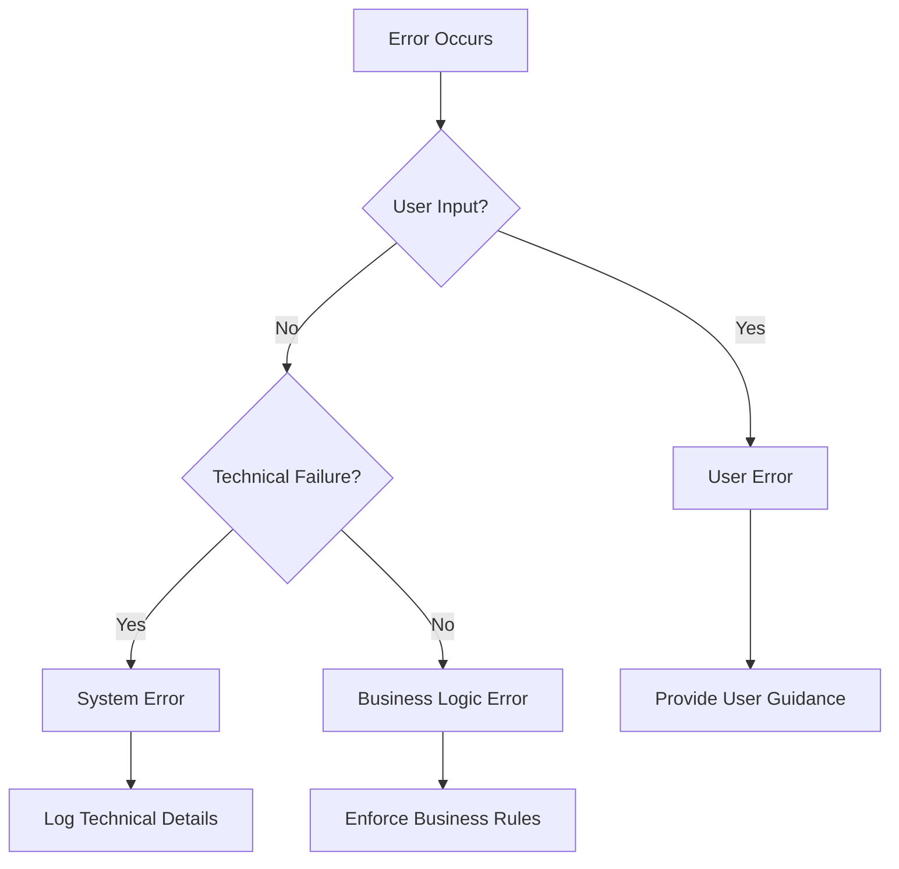

# Error Categories Reference

This document outlines the categorization system used for errors in Dewey.

## Overview

Errors in Dewey are categorized into three main groups based on their origin and impact:

1. **User Errors**: Errors caused by invalid user input or actions
2. **System Errors**: Errors caused by technical failures
3. **Business Logic Errors**: Errors caused by business rule violations

## Category Details

### User Errors

User errors occur when the input provided by the user is invalid or doesn't meet the required criteria.

**Characteristics:**
- Client-side validation should catch most of these
- Can be resolved by user action
- Should provide clear guidance to users
- Typically non-critical severity

**Common Causes:**
- Invalid input format
- Missing required fields
- Out-of-range values
- Invalid combinations of inputs

### System Errors

System errors occur when there are technical failures in the application infrastructure.

**Characteristics:**
- Often require technical intervention
- May indicate infrastructure problems
- Can be critical to system operation
- Should be logged with detailed technical information

**Common Causes:**
- Database connection failures
- File system errors
- Network issues
- Resource exhaustion
- Third-party service failures

### Business Logic Errors

Business logic errors occur when an operation violates business rules or constraints.

**Characteristics:**
- Enforce business rules and constraints
- May require business process changes
- Often need business context to resolve
- Can be critical to business operations

**Common Causes:**
- Invalid state transitions
- Business rule violations
- Permission issues
- Resource conflicts
- Business process violations

## Category Decision Tree

## Related Documentation

- [Error Types Reference](error-types.md)
- [Error Severity Reference](error-severity.md)
- [Error Handling Guide](../core-concepts/error-handling.md) 