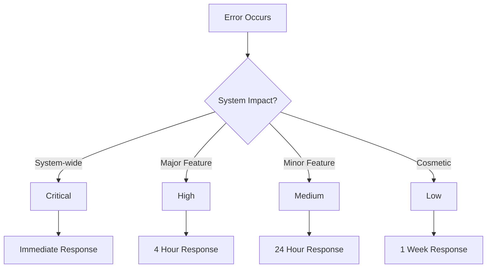

# Error Severity Reference

This document outlines the severity levels used for errors in Dewey.

## Overview

Errors in Dewey are assigned severity levels to help prioritize responses and determine appropriate handling strategies. The severity levels are:

1. **Critical**: System-wide impact requiring immediate attention
2. **High**: Significant impact on core functionality
3. **Medium**: Moderate impact on non-critical features
4. **Low**: Minor impact with workarounds available

## Severity Levels

### Critical

**Definition:**
Errors that prevent core system functionality or pose significant security risks.

**Characteristics:**
- System-wide impact
- No workarounds available
- Requires immediate attention
- May affect multiple users

**Examples:**
- Database connection failures
- Authentication system failures
- Core service crashes
- Security breaches

**Response Time:**
- Immediate response required
- 24/7 on-call escalation
- Incident response team activation

### High

**Definition:**
Errors that significantly impact core functionality but have partial workarounds.

**Characteristics:**
- Major feature impact
- Limited workarounds available
- Requires prompt attention
- Affects multiple users

**Examples:**
- Payment processing failures
- Data synchronization issues
- Performance degradation
- Feature unavailability

**Response Time:**
- Response within 4 hours
- Business hours escalation
- Priority bug fix

### Medium

**Definition:**
Errors that impact non-critical features or have clear workarounds.

**Characteristics:**
- Limited feature impact
- Clear workarounds available
- Scheduled attention
- Affects individual users

**Examples:**
- UI rendering issues
- Non-critical feature bugs
- Performance optimizations
- Minor data inconsistencies

**Response Time:**
- Response within 24 hours
- Regular bug fix cycle
- Feature team review

### Low

**Definition:**
Errors that have minimal impact and multiple workarounds.

**Characteristics:**
- Minor feature impact
- Multiple workarounds available
- Low priority attention
- Affects individual users

**Examples:**
- Cosmetic UI issues
- Documentation updates
- Minor usability improvements
- Non-blocking warnings

**Response Time:**
- Response within 1 week
- Regular maintenance cycle
- Team backlog review

## Severity Decision Matrix

## Related Documentation

- [Error Types Reference](error-types.md)
- [Error Categories Reference](error-categories.md)
- [Error Handling Guide](../core-concepts/error-handling.md) 