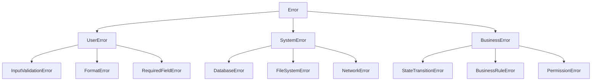

# Error Types Reference

This document provides a comprehensive reference of all error types used in Dewey.

## User Errors

### InputValidationError
- **Code**: `USER_INPUT_VALIDATION`
- **Description**: Occurs when user input fails validation
- **Example**: Invalid email format, missing required fields

### FormatError
- **Code**: `USER_FORMAT_ERROR`
- **Description**: Input format does not match expected pattern
- **Example**: Invalid date format, malformed JSON

### RequiredFieldError
- **Code**: `USER_REQUIRED_FIELD`
- **Description**: Required field is missing or empty
- **Example**: Missing password field

## System Errors

### DatabaseError
- **Code**: `SYSTEM_DATABASE`
- **Description**: Database operation failure
- **Subtypes**:
  - ConnectionError
  - QueryError
  - TransactionError

### FileSystemError
- **Code**: `SYSTEM_FILESYSTEM`
- **Description**: File system operation failure
- **Subtypes**:
  - FileNotFoundError
  - PermissionError
  - IOError

### NetworkError
- **Code**: `SYSTEM_NETWORK`
- **Description**: Network communication failure
- **Subtypes**:
  - ConnectionTimeout
  - DNSResolutionError
  - SSLHandshakeError

## Business Logic Errors

### StateTransitionError
- **Code**: `BUSINESS_STATE_TRANSITION`
- **Description**: Invalid state transition attempted
- **Example**: Trying to complete an already completed order

### BusinessRuleError
- **Code**: `BUSINESS_RULE_VIOLATION`
- **Description**: Business rule violation
- **Example**: Insufficient funds for transaction

### PermissionError
- **Code**: `BUSINESS_PERMISSION`
- **Description**: User lacks required permissions
- **Example**: Unauthorized access to admin functions

## Error Type Hierarchy

## Related Documentation

- [Error Categories Reference](error-categories.md)
- [Error Severity Reference](error-severity.md)
- [Error Handling Guide](../core-concepts/error-handling.md) 